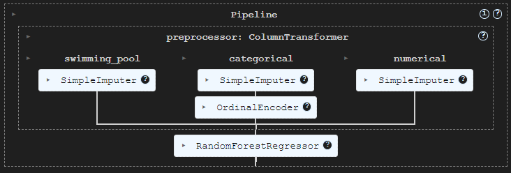

# Immozil(l)a - Cleaning / EDA 


[](https://docs.python.org/3/library/pickle.html)
[](https://scikit-learn.org/stable/modules/generated/sklearn.ensemble.RandomForestClassifier.html)


## 📖 Description
This project is a follow up on the Immoweb webscraping/cleaning/EDA project in https://github.com/NathNacht/immo-eliza-scraping-immozila-Cleaning-EDA

The mission is to preprocess the data for machine learning and build a performant learning model to predict prices of real estate properties in Belgium.

More info on the trainingdata and steps took to create the model can be found in the MODELSCARD.md file.


## 🛠 Installation

#### Basic installation

* clone the repo
```bash
git clone git@github.com:NathNacht/immo-eliza-ml.git
```

* Install all the libraries in requirements.txt
```bash
pip install -r requirements.txt
```

* To train the model again, run the script (more info can be found in the MODELSCARD.md file)
```bash
$ python3 train.py
```

* Two model .pkl files will be created (one for houses and one for apartments)

* Run the script to generate predictions
For apartments
```bash
$ python3 predict.py -i "data/predictions/new_app_data.csv" -o "data/predictions/app_predicted.csv" -p "app"
```
For Houses
```bash
$ python3 predict.py -i "data/predictions/new_house_data.csv" -o "data/predictions/house_predicted.csv" -p "house"
```

#### Installation from refactored code (Pipelines and OrdinalEncoder)

To prepare the code for deployment through an API a refactoring was done to use pipelines.
The One-Hot encoding preprocessing step was replaced by a OrdinalEncoder but results and performance of the model in the end are the same. 

Installation steps are the same as the basic installation, but different files were created for this.

The pipeline itself looks like this:



* clone the repo
```bash
git clone git@github.com:NathNacht/immo-eliza-ml.git
```

* Install all the libraries in requirements.txt
```bash
pip install -r requirements.txt
```

* To train the model again, run the script (more info can be found in the MODELSCARD.md file)
```bash
$ python3 train_with_pipeline.py
```

* Two model .pkl files will be created (one for houses and one for apartments)

* Run the script to generate predictions
For apartments
```bash
$ python3 predict_with_pipeline.py -i "data/predictions/new_app_data_pipeline.csv" -o "data/predictions/app_predicted_pipeline.csv" -p "app"
```
For Houses
```bash
$ python3 predict_with_pipeline.py -i "data/predictions/new_house_data_pipeline.csv" -o "data/predictions/house_predicted_pipeline.csv" -p "house"
```


## 👾 Preprocessing steps before training the model
1. **Removing variables**:
   
| removed vars from initial data | reason                                    |
|--------------------------------|-------------------------------------------|
| property_id                    | as all records have a unique property_id  |
| surface_of_good                | in apartments dataset it is always empty  |
| latitude                       |                                           |
| longitude                      |                                           |
| property_type                  |                                           |
| type_of_sale                   |                                           |
| fully_equipped_kitchen         | kitchen_type is enough for training model |                                           |
| locality_name                  |                                           |
| main_city                      | postal code is enough for training model  |

2. **Filling up missing values for the swimming_pool column with 0**

3. **One hot encoding (and in the final pipeline, ordinal encoding instead) of categorical variables to not have empty columns:**
- kitchen_type
- state_of_the_building
- property_subtype
- province

4. **Constant imputer (-1) for missing values for following columns:**
- number_of_rooms
- terrace_area
- garden_area
- furnished
- garden
- terrace
- number_of_facades

## 🚀 Usage

The model created can be used to predict prices of real estate properties in Belgium (see MODELSCARD.md for more details)
When training the model again you see the scores in the terminal.

## 🤖 Project File structure
```
├── MODELSCARD.md
├── README.md
├── data
│   ├── clean_app.csv
│   ├── clean_house.csv
│   ├── models
│   │   ├── rfr_app_model.pkl
│   │   ├── rfr_app_model_with_pipeline.pkl
│   │   ├── rfr_house_model.pkl
│   │   └── rfr_house_model_with_pipeline.pkl
│   ├── predictions
│   │   ├── app_predicted.csv
│   │   ├── app_predicted_pipeline.csv
│   │   ├── house_predicted.csv
│   │   ├── house_predicted_pipeline.csv
│   │   ├── new_app_data.csv
│   │   ├── new_app_data_pipeline.csv
│   │   ├── new_house_data.csv
│   │   └── new_house_data_pipeline.csv
│   ├── properties.csv
│   ├── properties_apartments.csv
│   └── properties_houses.csv
├── image.png
├── notebooks
│   └── ....ipynb (various notebooks used to build and test the model)
├── predict.py
├── predict_with_pipeline.py
├── preprocessing.py
├── preprocessing_with_pipeline.py
├── requirements.txt
├── train.py
└── train_with_pipeline.py
```


## 📜 Timeline

This project was implemented in 5 days.
